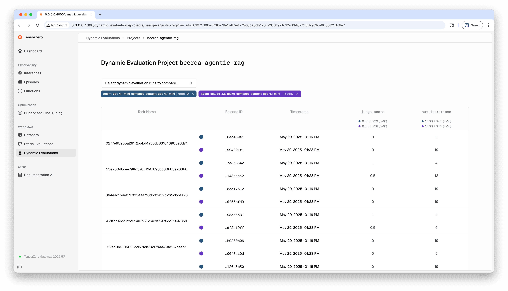

Dynamic evaluations enable you to evaluate complex workflows that combine multiple inference calls with arbitrary application logic.
Here, we'll walk through a stylized RAG workflow to illustrate the process of setting up and running a dynamic evaluation, but the same process can be applied to any complex workflow.

Imagine we have the following LLM-powered workflow in response to a natural-language question from a user:

1. Inference: Call the `generate_database_query` TensorZero function to generate a database query from the user's question.
2. Custom Logic: Run the database query against a database and retrieve the results (`my_blackbox_search_function`).
3. Inference: Call the `generate_final_answer` TensorZero function to generate an answer from the retrieved results.
4. Custom Logic: Score the answer using a custom scoring function (`my_blackbox_scoring_function`)
5. Feedback: Send feedback using the `task_success` metric.

Evaluating `generate_database_query` and `generate_final_answer` in a vacuum (i.e. using inference evaluations) can also be helpful, but ultimately we want to evaluate the entire workflow end-to-end.
This is where workflow evaluations come in.

Complex LLM applications might need to make multiple LLM calls and execute arbitrary code before giving an overall result.
In agentic applications, the workflow might even be defined dynamically at runtime based on the user's input, the results of the LLM calls, or other factors.
Dynamic evaluations in TensorZero provide complete flexibility and enable you to evaluate the entire workflow jointly.
You can think of them like integration tests for your LLM applications.

<Tip>

For a more complex, runnable example, see the [Workflow Evaluations for Agentic RAG Example on GitHub](https://github.com/tensorzero/tensorzero/tree/main/examples/dynamic_evaluations/simple-agentic-rag).

</Tip>

## Starting a dynamic evaluation run

Evaluating the workflow above involves tackling and evaluating a collection of tasks (e.g. user queries).
Each individual task corresponds to an _episode_, and the collection of these episodes is a _dynamic evaluation run_.

<Tabs>

<Tab title="Python">

First, let's initialize the TensorZero client (just like you would for typical inference requests):

```python
from tensorzero import TensorZeroGateway

# Initialize the client with `build_http` or `build_embedded`
with TensorZeroGateway.build_http(
    gateway_url="http://localhost:3000",
) as t0:
    # ...
```

Now you can start a dynamic evaluation run.

During a dynamic evaluation run, you specify which variants you want to pin during the run (i.e. the set of variants you want to evaluate).
This allows you to see the effects of different combinations of variants on the end-to-end system's performance.

<Tip>

You don't have to specify a variant for every function you use; if you don't specify a variant, the TensorZero Gateway will sample a variant for you as it normally would.

</Tip>

You can optionally also specify a `project_name` and `display_name` for the run.
If you specify a `project_name`, you'll be able to compare this run against other runs for that project using the TensorZero UI.
The `display_name` is a human-readable identifier for the run that you can use to identify the run in the TensorZero UI.

```python
run_info = t0.dynamic_evaluation_run(
    # Assume we have these variants defined in our `tensorzero.toml` configuration file
    variants={
        "generate_database_query": "o4_mini_prompt_baseline",
        "generate_final_answer": "gpt_4o_updated_prompt",
    },
    project_name="simple_rag_project",
    display_name="generate_database_query::o4_mini_prompt_baseline;generate_final_answer::gpt_4o_updated_prompt",
)
```

<Tip>

The TensorZero client automatically tags your dynamic evaluation runs with information about your Git repository if available (e.g. branch name, commit hash).
This metadata is displayed in the TensorZero UI so that you have a record of the code that was used to run the dynamic evaluation.
We recommend that you commit your changes before running a dynamic evaluation so that the Git state is accurately captured.

</Tip>

</Tab>
<Tab title="Python (Async)">

First, let's initialize the TensorZero client (just like you would for typical inference requests):

```python
from tensorzero import AsyncTensorZeroGateway

# Initialize the client with `build_http` or `build_embedded`
async with await AsyncTensorZeroGateway.build_http(
    gateway_url="http://localhost:3000",
) as t0:
    # ...
```

Now you can start a dynamic evaluation run.

During a dynamic evaluation run, you specify which variants you want to pin during the run (i.e. the set of variants you want to evaluate).
This allows you to see the effects of different combinations of variants on the end-to-end system's performance.

<Tip>

You don't have to specify a variant for every function you use; if you don't specify a variant, the TensorZero Gateway will sample a variant for you as it normally would.

</Tip>

You can optionally also specify a `project_name` and `display_name` for the run.
If you specify a `project_name`, you'll be able to compare this run against other runs for that project using the TensorZero UI.
The `display_name` is a human-readable identifier for the run that you can use to identify the run in the TensorZero UI.

```python
run_info = await t0.dynamic_evaluation_run(
    # Assume we have these variants defined in our `tensorzero.toml` configuration file
    variants={
        "generate_database_query": "o4_mini_prompt_baseline",
        "generate_final_answer": "gpt_4o_updated_prompt",
    },
    project_name="simple_rag_project",
    display_name="generate_database_query::o4_mini_prompt_baseline;generate_final_answer::gpt_4o_updated_prompt",
)
```

<Tip>

The TensorZero client automatically tags your dynamic evaluation runs with information about your Git repository if available (e.g. branch name, commit hash).
This metadata is displayed in the TensorZero UI so that you have a record of the code that was used to run the dynamic evaluation.
We recommend that you commit your changes before running a dynamic evaluation so that the Git state is accurately captured.

</Tip>

</Tab>
<Tab title="HTTP">

During a dynamic evaluation run, you specify which variants you want to pin during the run (i.e. the set of variants you want to evaluate).
This allows you to see the effects of different combinations of variants on the end-to-end system's performance.

<Tip>

You don't have to specify a variant for every function you use; if you don't specify a variant, the TensorZero Gateway will sample a variant for you as it normally would.

</Tip>

You can optionally also specify a `project_name` and `display_name` for the run.
If you specify a `project_name`, you'll be able to compare this run against other runs for that project using the TensorZero UI.
The `display_name` is a human-readable identifier for the run that you can use to identify the run in the TensorZero UI.

```bash
curl -X POST http://localhost:3000/dynamic_evaluation_run \
  -H "Content-Type: application/json" \
  -d '{
    "variants": {
      "generate_database_query": "o4_mini_prompt_baseline",
      "generate_final_answer": "gpt_4o_updated_prompt"
    },
    "project_name": "simple_rag_project",
    "display_name": "generate_database_query::o4_mini_prompt_baseline;generate_final_answer::gpt_4o_updated_prompt"
  }'
```

</Tab>

</Tabs>

## Starting an episode in a dynamic evaluation run

For each task we want to include in our dynamic evaluation run, we need to start an episode.
For example, in our agentic RAG project, each episode will correspond to a user query from our dataset; each user query requires multiple inference calls and application logic to run.

<Tabs>

<Tab title="Python">

To initialize an episode, you need to provide the `run_id` of the dynamic evaluation run you want to include the episode in.
You can optionally also specify a `task_name` for the episode.
If you specify a `task_name`, you'll be able to compare this episode against episodes for that task from other runs using the TensorZero UI.
We encourage you to use the `task_name` to provide a meaningful identifier for the task that the episode is tackling.

```python
episode_info = t0.dynamic_evaluation_run_episode(
    run_id=run_info.run_id,
    task_name="user_query_123",
)
```

Now we can use `episode_info.episode_id` to make inference and feedback calls.

</Tab>

<Tab title="Python (Async)">

To initialize an episode, you need to provide the `run_id` of the dynamic evaluation run you want to include the episode in.
You can optionally also specify a `task_name` for the episode.
If you specify a `task_name`, you'll be able to compare this episode against episodes for that task from other runs using the TensorZero UI.

```python
episode_info = await t0.dynamic_evaluation_run_episode(
    run_id=run_info.run_id,
    task_name="user_query_123",
)
```

Now we can use `episode_info.episode_id` to make inference and feedback calls.

</Tab>

<Tab title="HTTP">

To initialize an episode, you need to provide the `run_id` of the dynamic evaluation run you want to include the episode in.
You can optionally also specify a `task_name` for the episode.
If you specify a `task_name`, you'll be able to compare this episode against episodes for that task from other runs using the TensorZero UI.

```bash
curl -X POST http://localhost:3000/dynamic_evaluation_run/{run_id}/episode \
  -H "Content-Type: application/json" \
  -d '{
    "task_name": "user_query_123"
  }'
```

Now we can use `episode_info.episode_id` to make inference and feedback calls.

</Tab>

</Tabs>

## Making inference and feedback calls during a dynamic evaluation run

<Tip title="New to TensorZero?">

See our [Quickstart](/quickstart/) to learn how to set up our LLM gateway, observability, and fine-tuning &mdash; in just 5 minutes.

</Tip>

<Tip title="Using the OpenAI SDK?">

You can also use the OpenAI SDK for inference calls.
See the [Quickstart](/quickstart/) for more details.

(Similarly, you can also use workflow evaluations with any framework or agent that is OpenAI-compatible by passing along the episode ID and function name in the request to TensorZero.)

</Tip>

<Tabs>

<Tab title="Python">

```python
generate_database_query_response = t0.inference(
    function_name="generate_database_query",
    episode_id=episode_info.episode_id,
    input={ ... },
)

search_result = my_blackbox_search_function(generate_database_query_response)

generate_final_answer_response = t0.inference(
    function_name="generate_final_answer",
    episode_id=episode_info.episode_id,
    input={ ... },
)

task_success_score = my_blackbox_scoring_function(generate_final_answer_response)

t0.feedback(
    metric_name="task_success",
    episode_id=episode_info.episode_id,
    value=task_success_score,
)
```

</Tab>

<Tab title="Python (Async)">

```python
generate_database_query_response = await t0.inference(
    function_name="generate_database_query",
    episode_id=episode_info.episode_id,
    input={ ... },
)

search_result = my_blackbox_search_function(generate_database_query_response)

generate_final_answer_response = await t0.inference(
    function_name="generate_final_answer",
    episode_id=episode_info.episode_id,
    input={ ... },
)

task_success_score = my_blackbox_scoring_function(generate_final_answer_response)

await t0.feedback(
    metric_name="task_success",
    episode_id=episode_info.episode_id,
    value=task_success_score,
)
```

</Tab>

<Tab title="HTTP">

```bash
# First inference call
curl -X POST http://localhost:3000/inference \
  -H "Content-Type: application/json" \
  -d '{
    "function_name": "generate_database_query",
    "episode_id": "00000000-0000-0000-0000-000000000000",
    "input": { ... }
  }'

# Run your custom search function with the result...
my_blackbox_search_function(...)

# Second inference call
curl -X POST http://localhost:3000/inference \
  -H "Content-Type: application/json" \
  -d '{
    "function_name": "generate_final_answer",
    "episode_id": "00000000-0000-0000-0000-000000000000",
    "input": { ... }
  }'

# Run your custom scoring function with the result...
my_blackbox_scoring_function(...)

# Feedback call
curl -X POST http://localhost:3000/feedback \
  -H "Content-Type: application/json" \
  -d '{
    "metric_name": "task_success",
    "episode_id": "00000000-0000-0000-0000-000000000000",
    "value": 0.85
  }'
```

</Tab>

</Tabs>

## Visualizing evaluation results in the TensorZero UI

Once you finish running all the relevant episodes for your dynamic evaluation run, you can visualize the results in the TensorZero UI.

In the UI, you can compare metrics across evaluation runs, inspect individual episodes and inferences, and more.


