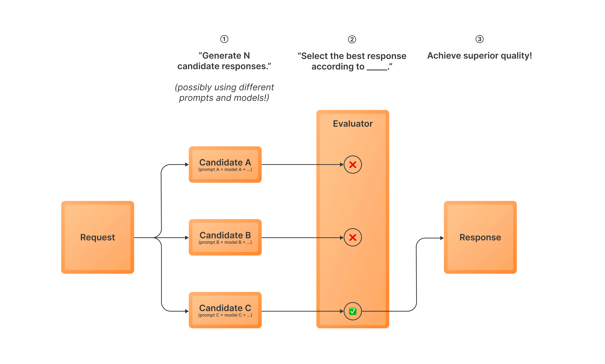
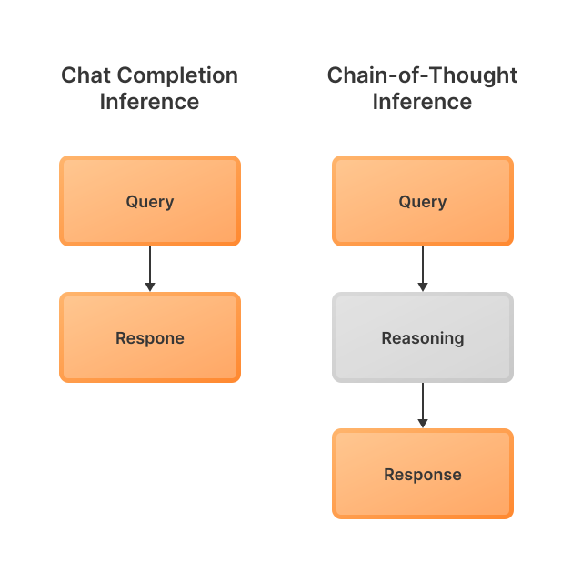
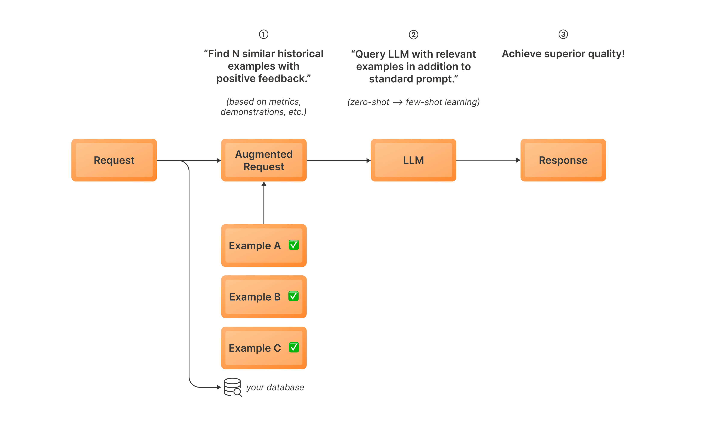
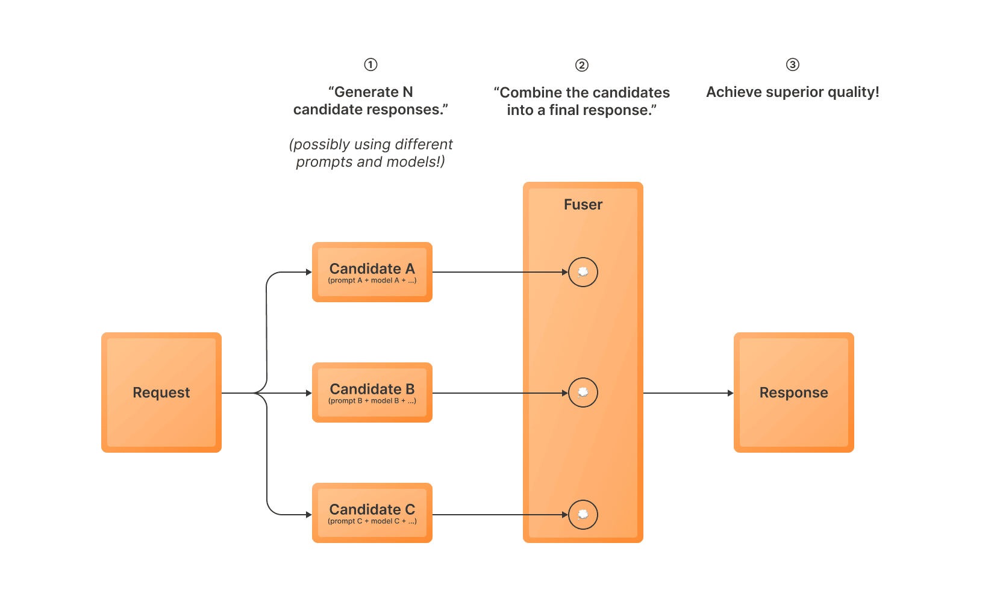

Inference-time optimizations are powerful techniques that can significantly enhance the performance of your LLM applications without the need for model fine-tuning.

This guide will explore two key strategies implemented as variant types in TensorZero: Best-of-N (BoN) sampling and Dynamic In-Context Learning (DICL).
Best-of-N sampling generates multiple response candidates and selects the best one using an evaluator model, while Dynamic In-Context Learning enhances context by incorporating relevant historical examples into the prompt.
Both techniques can lead to improved response quality and consistency in your LLM applications.

## Best-of-N Sampling



Best-of-N (BoN) sampling is an inference-time optimization strategy that can significantly improve the quality of your LLM outputs.
Here's how it works:

1. Generate multiple response candidates using one or more variants (i.e. possibly using different models and prompts)
2. Use an evaluator model to select the best response from these candidates
3. Return the selected response as the final output

This approach allows you to leverage multiple prompts or variants to increase the likelihood of getting a high-quality response.
It's particularly useful when you want to benefit from an ensemble of variants or reduce the impact of occasional bad generations.
Best-of-N sampling is also commonly referred to as rejection sampling in some contexts.

<Tip>

TensorZero also supports a similar inference-time strategy called [Mixture-of-N Sampling](#mixture-of-n-sampling).

</Tip>

To use BoN sampling in TensorZero, you need to configure a variant with the `experimental_best_of_n` type.
Here's a simple example configuration:

```toml title="tensorzero.toml"
[functions.draft_email.variants.promptA]
type = "chat_completion"
model = "gpt-4o-mini"
user_template = "functions/draft_email/promptA/user.minijinja"

[functions.draft_email.variants.promptB]
type = "chat_completion"
model = "gpt-4o-mini"
user_template = "functions/draft_email/promptB/user.minijinja"

[functions.draft_email.variants.best_of_n]
type = "experimental_best_of_n"
candidates = ["promptA", "promptA", "promptB"]

[functions.draft_email.variants.best_of_n.evaluator]
model = "gpt-4o-mini"
user_template = "functions/draft_email/best_of_n/user.minijinja"

[functions.draft_email.experimentation]
type = "uniform"
candidate_variants = [
  "best_of_n",
] # so we don't sample `promptA` or `promptB` directly
```

In this configuration:

- We define a `best_of_n` variant that uses two different variants (`promptA` and `promptB`) to generate candidates.
  It generates two candidates using `promptA` and one candidate using `promptB`.
- The `evaluator` block specifies the model and instructions for selecting the best response.

<Tip>

You should define the evaluator model as if it were solving the problem (not judging the quality of the candidates).
TensorZero will automatically make the necessary prompt modifications to evaluate the candidates.

</Tip>

Read more about the `experimental_best_of_n` variant type in [Configuration Reference](/gateway/configuration-reference/#type-experimental_best_of_n).

<Tip>

We also provide a complete runnable example:

[Improving LLM Chess Ability with Best/Mixture-of-N Sampling](https://github.com/tensorzero/tensorzero/tree/main/examples/chess-puzzles)

This example showcases how best-of-N sampling can significantly enhance an LLM's chess-playing abilities by selecting the most promising moves from multiple generated options.

</Tip>

## Chain-of-Thought (CoT)



Chain-of-Thought (CoT) is an inference-time optimization strategy that enhances LLM performance by encouraging the model to reason step by step before producing a final answer.
This technique encourages the model to think through the problem, making it more likely to produce a correct and coherent response.

The `experimental_chain_of_thought` variant type is only available for non-streaming requests to JSON functions.
For chat functions, we recommend using reasoning models instead (e.g. OpenAI o3, DeepSeek R1).

To use CoT in TensorZero, you need to configure a variant with the `experimental_chain_of_thought` type.
It uses the same configuration as a `chat_completion` variant.

Under the hood, TensorZero will prepend an additional field to the desired output schema to include the chain-of-thought reasoning and remove it from the final output.
The reasoning is stored in the database for downstream observability and optimization.

## Dynamic In-Context Learning (DICL)



Dynamic In-Context Learning (DICL) is an inference-time optimization strategy that enhances LLM performance by incorporating relevant historical examples into the prompt.
This technique leverages a database of past interactions to select and include contextually similar examples in the current prompt, allowing the model to adapt to specific tasks or domains without requiring fine-tuning.
By dynamically augmenting the input with relevant historical data, DICL enables the LLM to make more informed and accurate responses, effectively learning from past experiences in real-time.

Here's how it works:

0. Before inference: Curate reference examples, embed them, and store in the database
1. Embed the current input using an embedding model and retrieve similar high-quality examples from a database of past interactions
2. Incorporate these examples into the prompt to provide additional context
3. Generate a response using the enhanced prompt

To use DICL in TensorZero, you need to configure a variant with the `experimental_dynamic_in_context_learning` type.
Here's a simple example configuration:

```toml title="tensorzero.toml"
[functions.draft_email.variants.dicl]
type = "experimental_dynamic_in_context_learning"
model = "gpt-4o-mini"
embedding_model = "text-embedding-3-small"
system_instructions = "functions/draft_email/dicl/system.txt"
k = 5
max_distance = 0.5                                            # Optional: filter examples by cosine distance

[embedding_models.text-embedding-3-small]
routing = ["openai"]

[embedding_models.text-embedding-3-small.providers.openai]
type = "openai"
model_name = "text-embedding-3-small"
```

In this configuration:

- We define a `dicl` variant that uses the `experimental_dynamic_in_context_learning` type.
- The `embedding_model` field specifies the model used to embed inputs for similarity search.
  We also need to define this model in the `embedding_models` section.
- The `k` parameter determines the number of similar examples to retrieve and incorporate into the prompt.
- The optional `max_distance` parameter filters examples based on their cosine distance from the input, ensuring only highly relevant examples are included.

To use Dynamic In-Context Learning (DICL), you also need to add relevant examples to the `DynamicInContextLearningExample` table in your ClickHouse database.
These examples will be used by the DICL variant to enhance the context of your prompts at inference time.

The process of adding these examples to the database is crucial for DICL to function properly.
We provide a sample recipe that simplifies this process: [Dynamic In-Context Learning with OpenAI](https://github.com/tensorzero/tensorzero/tree/main/recipes/dicl).

This recipe supports selecting examples based on boolean metrics, float metrics, and demonstrations.
It helps you populate the `DynamicInContextLearningExample` table with high-quality, relevant examples from your historical data.

For more information on the `DynamicInContextLearningExample` table and its role in the TensorZero data model, see [Data Model](/gateway/data-model/).
For a comprehensive list of configuration options for the `experimental_dynamic_in_context_learning` variant type, see [Configuration Reference](/gateway/configuration-reference/#type-experimental_dynamic_in_context_learning).

<Tip>

We also provide a complete runnable example:

[Optimizing Data Extraction (NER) with TensorZero](https://github.com/tensorzero/tensorzero/tree/main/examples/data-extraction-ner)

This example demonstrates how Dynamic In-Context Learning (DICL) can enhance Named Entity Recognition (NER) performance by leveraging relevant historical examples to improve data extraction accuracy and consistency without having to fine-tune a model.

</Tip>

## Mixture-of-N Sampling



Mixture-of-N (MoN) sampling is an inference-time optimization strategy that can significantly improve the quality of your LLM outputs.
Here's how it works:

1. Generate multiple response candidates using one or more variants (i.e. possibly using different models and prompts)
2. Use a fuser model to combine the candidates into a single response
3. Return the combined response as the final output

This approach allows you to leverage multiple prompts or variants to increase the likelihood of getting a high-quality response.
It's particularly useful when you want to benefit from an ensemble of variants or reduce the impact of occasional bad generations.

<Tip>

TensorZero also supports a similar inference-time strategy called [Best-of-N Sampling](#best-of-n-sampling).

</Tip>

To use MoN sampling in TensorZero, you need to configure a variant with the `experimental_mixture_of_n` type.
Here's a simple example configuration:

```toml title="tensorzero.toml"
[functions.draft_email.variants.promptA]
type = "chat_completion"
model = "gpt-4o-mini"
user_template = "functions/draft_email/promptA/user.minijinja"

[functions.draft_email.variants.promptB]
type = "chat_completion"
model = "gpt-4o-mini"
user_template = "functions/draft_email/promptB/user.minijinja"

[functions.draft_email.variants.mixture_of_n]
type = "experimental_mixture_of_n"
candidates = ["promptA", "promptA", "promptB"]

[functions.draft_email.variants.mixture_of_n.fuser]
model = "gpt-4o-mini"
user_template = "functions/draft_email/mixture_of_n/user.minijinja"

[functions.draft_email.experimentation]
type = "uniform"
candidate_variants = [
  "mixture_of_n",
] # so we don't sample `promptA` or `promptB` directly
```

In this configuration:

- We define a `mixture_of_n` variant that uses two different variants (`promptA` and `promptB`) to generate candidates.
  It generates two candidates using `promptA` and one candidate using `promptB`.
- The `fuser` block specifies the model and instructions for combining the candidates into a single response.

<Tip>

You should define the fuser model as if it were solving the problem (not judging the quality of the candidates).
TensorZero will automatically make the necessary prompt modifications to combine the candidates.

</Tip>

Read more about the `experimental_mixture_of_n` variant type in [Configuration Reference](/gateway/configuration-reference/#type-experimental_mixture_of_n).

<Tip>

We also provide a complete runnable example:

[Improving LLM Chess Ability with Best/Mixture-of-N Sampling](https://github.com/tensorzero/tensorzero/tree/main/examples/chess-puzzles/)

This example showcases how Mixture-of-N sampling can significantly enhance an LLM's chess-playing abilities by selecting the most promising moves from multiple generated options.

</Tip>
