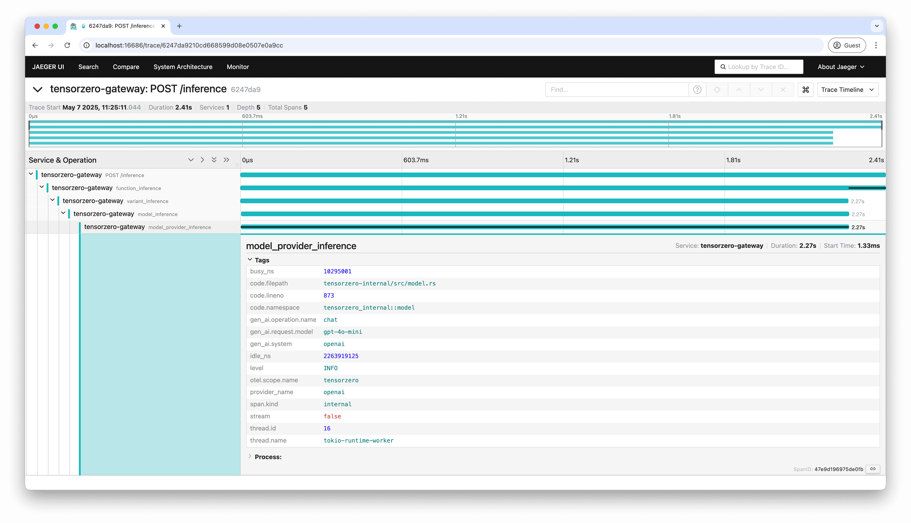

The TensorZero Gateway can export traces to an external OpenTelemetry-compatible observability system.

Exporting traces via OpenTelemetry allows you to monitor the TensorZero Gateway in external observability platforms such as Jaeger, Datadog, or Grafana.
This integration enables you to correlate gateway activity with the rest of your infrastructure, providing deeper insights and unified monitoring across your systems.

<Warning>

Exporting traces via OpenTelemetry does not replace the core observability features built into TensorZero.

Many key TensorZero features (including optimization) require richer observability data that TensorZero collects and stores in your ClickHouse database.
Traces exported through OpenTelemetry are for external observability only and are not sufficient for these built-in TensorZero capabilities.

</Warning>

<Tip>

You can find a complete runnable example exporting traces to Jaeger on [GitHub](https://github.com/tensorzero/tensorzero/tree/main/examples/guides/opentelemetry-otlp).

</Tip>

## Setup

1. Enable `export.otlp.traces.enabled` in the `[gateway]` section of the `tensorzero.toml` configuration file:

```toml
[gateway]
# ...
export.otlp.traces.enabled = true
# ...
```

2. Set the `OTEL_EXPORTER_OTLP_TRACES_ENDPOINT` environment variable in the gateway container to the endpoint of your OpenTelemetry service.

<Accordion title="Example: TensorZero Gateway and Jaeger with Docker Compose">

For example, if you're deploying the TensorZero Gateway and Jaeger in Docker Compose, you can set the following environment variable:

```bash
services:
  gateway:
    image: tensorzero/gateway
    environment:
      OTEL_EXPORTER_OTLP_TRACES_ENDPOINT: http://jaeger:4317
    # ...

  jaeger:
    image: jaegertracing/jaeger
    ports:
      - "4317:4317"
    # ...
```

</Accordion>

## Traces

Once configured, the TensorZero Gateway will begin sending traces to your OpenTelemetry-compatible service.

Traces are generated for each HTTP request handled by the gateway (excluding auxiliary endpoints).
For inference requests, these traces additionally contain spans that represent the processing of functions, variants, models, and model providers.



<small>
  Example: Screenshot of a TensorZero Gateway inference request trace in Jaeger
</small>

<Tip>

The TensorZero Gateway also provides a Prometheus-compatible metrics endpoint at `/metrics`.
This endpoint includes metrics about the gateway itself rather than the data processed by the gateway.
See [Auxiliary Endpoints](/gateway/api-reference/auxiliary-endpoints/) for more details.

</Tip>


### Custom HTTP headers

You can attach custom HTTP headers to the outgoing requests made to `OTEL_EXPORTER_OTLP_TRACES_ENDPOINT`. When making a request to a TensorZero HTTP endpoint, add a header prefixed with `tensorzero-otlp-traces-extra-header-`. For example:

```
tensorzero-otlp-traces-extra-header-my-first-header: my-first-value
tensorzero-otlp-traces-extra-header-my-second-header: my-second-value
```

This will attach the headers `my-first-header: my-first-value` and `my-second-header: my-second-value` when exporting any span associated with your TensorZero API request.
TensorZero API requests *without* these headers set will be unaffected.