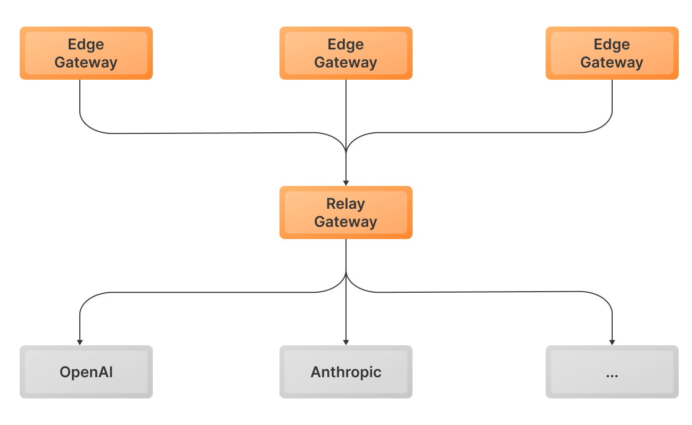

<Tip>

This feature is primarily for large organizations with complex deployment and governance needs.

</Tip>

With gateway relay, an LLM inference request can be routed through multiple independent TensorZero Gateway deployments before reaching a model provider.
This enables you to enforce organization-wide controls (e.g. [auth](/operations/set-up-auth-for-tensorzero), [rate limits](/operations/enforce-custom-rate-limits), [credentials](/operations/manage-credentials)) without restricting how teams build their LLM features.

A typical setup has two tiers:

- **Edge Gateways:** Each team runs their own gateway to manage prompts, functions, metrics, datasets, experimentation, and more.
- **Relay Gateway:** A central gateway that enforces organization-wide controls. Edge gateways forward requests here.



This guide shows you how to set up a two-tier TensorZero Gateway deployment that manages credentials in the relay.

# Configure

<Tip>

You can find a [complete runnable example](https://github.com/tensorzero/tensorzero/tree/main/examples/docs/guides/operations/centralize-auth-rate-limits-and-more/simple) of this guide on GitHub.

</Tip>

<Steps>

<Step title="Configure your relay gateway">

You can configure [auth](/operations/set-up-auth-for-tensorzero), [rate limits](/operations/enforce-custom-rate-limits), [credentials](/operations/manage-credentials), and other organization-wide controls in the relay gateway. See below for an example that enforces auth on the relay.

We'll keep this example minimal and use the default gateway configuration for the relay gateway.

</Step>

<Step title="Configure your edge gateway">

Configure the edge gateway to route inference requests to the relay gateway:

```toml title="edge-config/tensorzero.toml"
[gateway.relay]
gateway_url = "http://relay-gateway:3000"  # base URL configured in Docker Compose below
```

</Step>

<Step title="Deploy both gateways">

Let's deploy both gateways, but only provide API keys to the relay gateway.

```yaml title="docker-compose.yml"
services:
  edge-gateway:
    image: tensorzero/gateway
    volumes:
      # Mount our tensorzero.toml file into the container
      - ./edge-config:/app/config:ro
    command: --config-file /app/config/tensorzero.toml
    ports:
      - "3000:3000"
    extra_hosts:
      - "host.docker.internal:host-gateway"

  relay-gateway:
    image: tensorzero/gateway
    command: --default-config
    environment:
      - OPENAI_API_KEY=${OPENAI_API_KEY:?Environment variable OPENAI_API_KEY must be set.}
    extra_hosts:
      - "host.docker.internal:host-gateway"
```

<Warning>

If you're planning to set up ClickHouse or Postgres for both gateways, make sure they use separate logical databases.
It's fine for them to share the same deployment or cluster.

</Warning>

</Step>

<Step title="Make an inference request to the edge gateway">

Make an inference request to the edge gateway like you normally would.
You can use either the TensorZero Inference API or the OpenAI-compatible Inference API.

To keep things simple, let's make a request using `curl`:

```bash
curl -X POST "http://localhost:3000/inference" \
  -H "Content-Type: application/json" \
  -d '{
    "model_name": "openai::gpt-5-mini",
    "input": {
      "messages": [
        {
          "role": "user",
          "content": "Write a haiku about TensorZero."
        }
      ]
    }
  }'
```

<Accordion title="Sample Output">

```json
{
  "inference_id": "01940627-935f-7fa1-a398-e1f57f18064a",
  "episode_id": "01940627-8fe2-75d3-9b65-91be2c7ba622",
  "variant_name": "gpt-5-mini",
  "content": [
    {
      "type": "text",
      "text": "Wires hum with pure thought,  \nDreams of codes in twilight's glow,  \nBeyond human touch."
    }
  ],
  "usage": {
    "input_tokens": 15,
    "output_tokens": 23
  }
}
```

</Accordion>

</Step>

</Steps>

## Advanced

### Set up auth for the relay gateway

You can set up auth for the relay gateway to control which edge gateways are allowed to forward requests through it.
This ensures that only authorized teams can access the relay gateway and helps you enforce security policies across your organization.
When auth is enabled on the relay gateway, edge gateways must provide valid credentials (API keys) to authenticate their requests.

<Tip>

You can find a [complete runnable example](https://github.com/tensorzero/tensorzero/tree/main/examples/docs/guides/operations/centralize-auth-rate-limits-and-more/auth) of this guide on GitHub.

</Tip>

<Steps>

<Step title="Configure auth for the relay gateway">

```toml title="relay-config/tensorzero.toml"
[gateway]
auth.enabled = true
```

See [Set up auth for TensorZero](/operations/set-up-auth-for-tensorzero) for details.

</Step>

<Step title="Configure credentials in the edge gateway">

Add `api_key_location` to your edge gateway's configuration and provide the relevant credentials.

For example, let's configure the gateway to look for the API key in the `TENSORZERO_RELAY_API_KEY` environment variable:

```toml title="edge-config/tensorzero.toml"
[gateway.relay]
# ...
api_key_location = "env::TENSORZERO_RELAY_API_KEY"
# ...
```

Finally, provide the API key to the edge gateway:

```bash
TENSORZERO_RELAY_API_KEY="sk-t0-..."
```

See [Configuration Reference](/gateway/configuration-reference) for more details on `api_key_location`.

</Step>

</Steps>

### Bypass the relay for specific requests

When a relay gateway is configured, the edge gateway will route every inference request through it by default.
However, you may want to bypass the relay in some scenarios.

You can circumvent the relay for specific requests by configuring a custom model with `skip_relay = true` in the edge gateway:

```toml title="edge-config/tensorzero.toml"
[models.gpt_5_edge]
routing = ["openai"]
skip_relay = true

[models.gpt_5_edge.providers.openai]
type = "openai"
model_name = "gpt-5"
```

When you make an inference call to the `gpt_5_edge` model, the edge gateway will bypass the relay and call OpenAI directly using credentials available on the edge gateway.

The edge gateway must have the necessary provider credentials configured to make direct requests.
Models that skip the relay won't benefit from centralized rate limits, auth policies, or credential management enforced by the relay gateway.

### Set up dynamic credentials for the relay gateway

You can pass provider credentials dynamically at inference time, and the edge gateway will forward them to the relay gateway.

<Tip>

You can find a [complete runnable example](https://github.com/tensorzero/tensorzero/tree/main/examples/docs/guides/operations/centralize-auth-rate-limits-and-more/dynamic-credentials) of this guide on GitHub.

</Tip>

<Steps>

<Step title="Configure the relay gateway to expect dynamic credentials">

```toml title="relay-config/tensorzero.toml"
[provider_types.openai.defaults]
api_key_location = "dynamic::openai_api_key"
```

You can configure dynamic credentials for specific models or entire providers.
See [Manage credentials](/operations/manage-credentials) for more details on dynamic credentials.

</Step>

<Step title="Pass credentials in the inference request">

Pass the credentials in your inference request to the edge gateway.
The edge gateway will forward them to the relay gateway.

```bash
curl -X POST "http://localhost:3000/inference" \
  -H "Content-Type: application/json" \
  -d '{
    "model_name": "openai::gpt-5-mini",
    "input": {
      "messages": [
        {
          "role": "user",
          "content": "Write a haiku about TensorZero."
        }
      ]
    },
    "credentials": {
      "openai_api_key": "sk-..."
    }
  }'
```

</Step>

</Steps>
