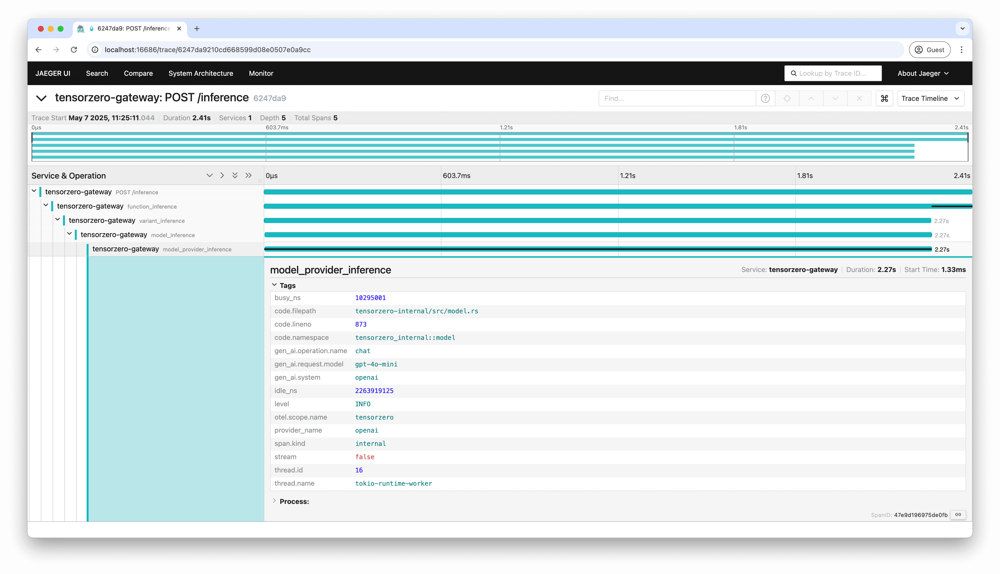

The TensorZero Gateway can export traces to an external OpenTelemetry-compatible observability system using OTLP.

Exporting traces via OpenTelemetry allows you to monitor the TensorZero Gateway in external observability platforms such as Jaeger, Datadog, or Grafana.
This integration enables you to correlate gateway activity with the rest of your infrastructure, providing deeper insights and unified monitoring across your systems.

Exporting traces via OpenTelemetry does not replace the core observability features built into TensorZero.
Many key TensorZero features (including optimization) require richer observability data that TensorZero collects and stores in your ClickHouse database.
Traces exported through OpenTelemetry are for external observability only.

<Tip>

The TensorZero Gateway also provides a Prometheus-compatible metrics endpoint at `/metrics`.
This endpoint includes metrics about the gateway itself rather than the data processed by the gateway.
See [Export Prometheus metrics](/operations/export-prometheus-metrics) for more details.

</Tip>

## Configure

<Tip>

You can find a [complete runnable example](https://github.com/tensorzero/tensorzero/tree/main/examples/guides/opentelemetry-otlp) exporting traces to Jaeger on GitHub.

</Tip>

<Steps>
<Step title="Set up the configuration">

Enable `export.otlp.traces.enabled` in the `[gateway]` section of the `tensorzero.toml` configuration file:

```toml
[gateway]
# ...
export.otlp.traces.enabled = true
# ...
```

</Step>
<Step title="Configure the OTLP traces endpoint">

Set the `OTEL_EXPORTER_OTLP_TRACES_ENDPOINT` environment variable in the gateway container to the endpoint of your OpenTelemetry service.

<Accordion title="Example: TensorZero Gateway and Jaeger with Docker Compose">

For example, if you're deploying the TensorZero Gateway and Jaeger in Docker Compose, you can set the following environment variable:

```bash
services:
  gateway:
    image: tensorzero/gateway
    environment:
      OTEL_EXPORTER_OTLP_TRACES_ENDPOINT: http://jaeger:4317
    # ...

  jaeger:
    image: jaegertracing/jaeger
    ports:
      - "4317:4317"
    # ...
```

</Accordion>

</Step>
<Step title="Browse the exported traces">

Once configured, the TensorZero Gateway will begin sending traces to your OpenTelemetry-compatible service.

Traces are generated for each HTTP request handled by the gateway (excluding auxiliary endpoints).
For inference requests, these traces additionally contain spans that represent the processing of functions, variants, models, and model providers.



<small>
  Example: Screenshot of a TensorZero Gateway inference request trace in Jaeger
</small>

</Step>
</Steps>

## Customize

### Send custom HTTP headers

You can attach custom HTTP headers to the outgoing OTLP export requests made to `OTEL_EXPORTER_OTLP_TRACES_ENDPOINT`.

#### Define custom headers in the configuration

You can configure static headers that will be included in all OTLP export requests by adding them to the `export.otlp.traces.extra_headers` field in your configuration file:

```toml title="tensorzero.toml"
[gateway.export.otlp.traces]
# ...
extra_headers.space_id = "my-workspace-123"
extra_headers."X-Environment" = "production"
# ...
```

#### Define custom headers during inference

You can also send custom headers dynamically on a per-request basis.
When there is a conflict between static and dynamic headers, the latter takes precedence.

<Tabs>

<Tab title="Python (TensorZero SDK)">

When using the TensorZero Python SDK, you can pass dynamic OTLP headers using the `otlp_traces_extra_headers` parameter in the `inference` method.
The headers will be automatically prefixed with `tensorzero-otlp-traces-extra-header-` for you:

```python
response = t0.inference(
    function_name="your_function_name",
    input={
        "messages": [
            {
                "role": "user",
                "content": "Write a haiku about artificial intelligence.",
            }
        ]
    },
    otlp_traces_extra_headers={
        "user-id": "user-123",
        "request-source": "mobile-app",
    },
)
```

This will attach the headers `user-id: user-123` and `request-source: mobile-app` when exporting any span associated with that specific inference request.

</Tab>

<Tab title="Python (OpenAI SDK)">

When using the OpenAI Python SDK with the TensorZero OpenAI-compatible endpoint, you can pass dynamic OTLP headers using the `extra_headers` parameter.
You must prefix header names with `tensorzero-otlp-traces-extra-header-`:

```python
from openai import OpenAI

client = OpenAI(api_key="not-used", base_url="http://localhost:3000/openai/v1")

result = client.chat.completions.create(
    model="tensorzero::function_name::your_function",
    messages=[
        {
            "role": "user",
            "content": "Write a haiku about artificial intelligence.",
        }
    ],
    extra_headers={
        "tensorzero-otlp-traces-extra-header-user-id": "user-123",
        "tensorzero-otlp-traces-extra-header-request-source": "mobile-app",
    },
)
```

This will attach the headers `user-id: user-123` and `request-source: mobile-app` when exporting any span associated with that specific inference request.

</Tab>

<Tab title="Node (OpenAI SDK)">

When using the OpenAI Node SDK with the TensorZero OpenAI-compatible endpoint, you can pass dynamic OTLP headers using the `headers` option in the second parameter.
You must prefix header names with `tensorzero-otlp-traces-extra-header-`:

```typescript
import OpenAI from "openai";

const client = new OpenAI({
  apiKey: "not-used",
  baseURL: "http://localhost:3000/openai/v1",
});

const result = await client.chat.completions.create(
  {
    model: "tensorzero::function_name::your_function",
    messages: [
      {
        role: "user",
        content: "Write a haiku about artificial intelligence.",
      },
    ],
  },
  {
    headers: {
      "tensorzero-otlp-traces-extra-header-user-id": "user-123",
      "tensorzero-otlp-traces-extra-header-request-source": "mobile-app",
    },
  },
);
```

This will attach the headers `user-id: user-123` and `request-source: mobile-app` when exporting any span associated with that specific inference request.

</Tab>

<Tab title="HTTP">

When making a request to a TensorZero HTTP endpoint, add a header prefixed with `tensorzero-otlp-traces-extra-header-`:

```bash
curl -X POST http://localhost:3000/inference \
  -H "Content-Type: application/json" \
  -H "tensorzero-otlp-traces-extra-header-user-id: user-123" \
  -H "tensorzero-otlp-traces-extra-header-request-source: mobile-app" \
  -d '{
    "function_name": "your_function_name",
    "input": {
      "messages": [
        {
          "role": "user",
          "content": "Write a haiku about artificial intelligence."
        }
      ]
    }
  }'
```

This will attach the headers `user-id: user-123` and `request-source: mobile-app` when exporting any span associated with that specific API request.

</Tab>

</Tabs>

### Send custom OpenTelemetry attributes

You can attach custom span attributes using headers prefixed with `tensorzero-otlp-traces-extra-attribute-`.
The values must be valid JSON; TensorZero currently supports strings and booleans only.
For example:

```bash
curl -X POST http://localhost:3000/inference \
  -H "tensorzero-otlp-traces-extra-attribute-user_id: \"user-123\"" \
  -H "tensorzero-otlp-traces-extra-attribute-is_premium: true" \
  -d '{ ... }'
```

### Send custom OpenTelemetry resources

You can attach custom resource attributes using headers prefixed with `tensorzero-otlp-traces-extra-resource-`.
For example:

```bash
curl -X POST http://localhost:3000/inference \
  -H "tensorzero-otlp-traces-extra-resource-service.namespace: production" \
  -d '{ ... }'
```

### Link to existing traces with `traceparent`

TensorZero automatically handles incoming `traceparent` headers for distributed tracing when OTLP is enabled.
This follows the [W3C Trace Context standard](https://www.w3.org/TR/trace-context/).

```bash
curl -X POST http://localhost:3000/inference \
  -H "traceparent: 00-0af7651916cd43dd8448eb211c80319c-b7ad6b7169203331-01" \
  -d '{ ... }'
```

TensorZero spans will become children of the incoming trace, preserving the trace ID across services.

### Export OpenInference traces

By default, TensorZero exports traces with attributes that follow the [OpenTelemetry Generative AI semantic conventions](https://github.com/open-telemetry/semantic-conventions/tree/main/docs/gen-ai).

You can instead choose to export traces with attributes that follow the [OpenInference semantic conventions](https://github.com/Arize-ai/openinference/blob/main/spec/llm_spans.md) by setting `export.otlp.traces.format = "openinference"` in your configuration file.
See [Configuration Reference](/gateway/configuration-reference/) for more details.
