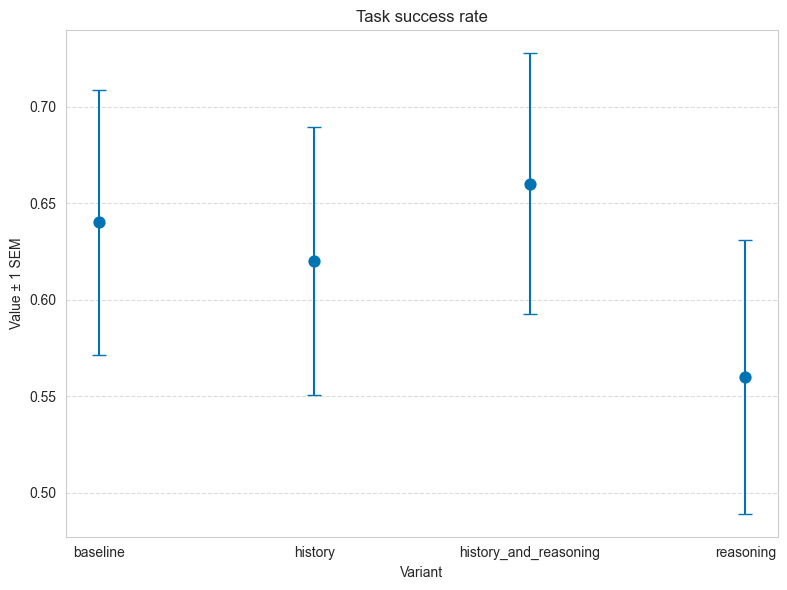
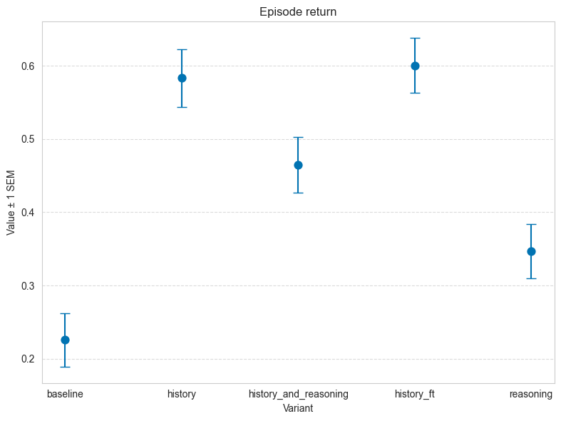
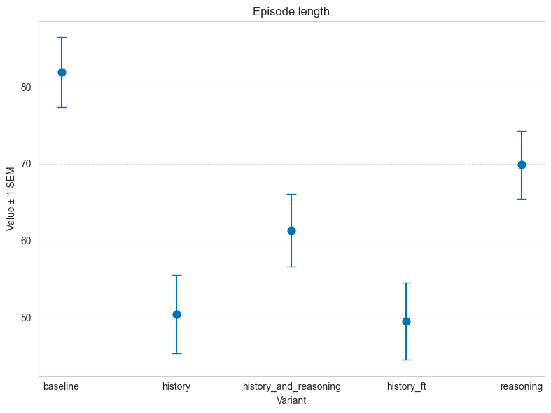
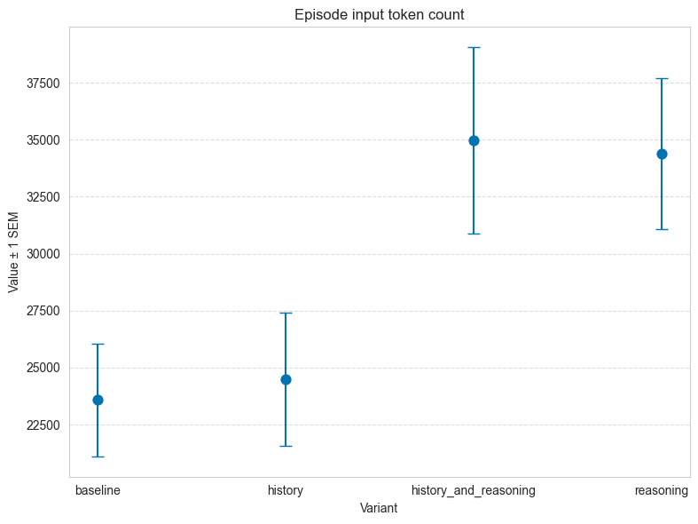
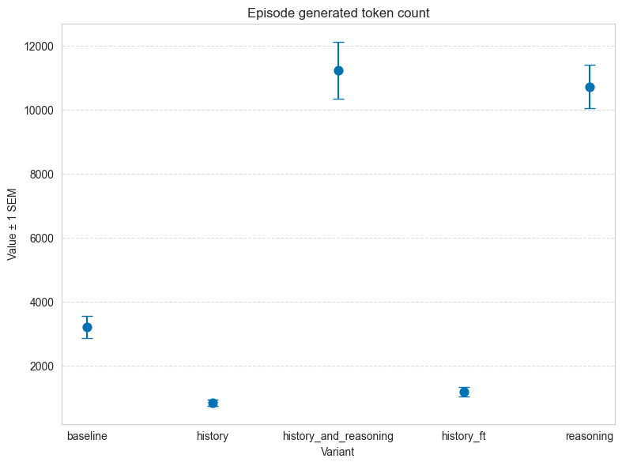

# Example: LLM applicationfor BabyAI

<!-- TensorZero was built to support inference strategies more sophisticated than just a single chat completion.

In this example, we'll show how you can drop in this experimental best-of-n variant type to spend additional compute budget for better performance on a challenging LLM benchmark. -->

## Background: BabyAI

[BabyAI](https://github.com/mila-iqia/babyai) is a grid world environment designed to test the sample efficiency of grounded language acquisition. Each task is described in natural language (e.g., "put the red ball next to the blue ball"). To complete a task, the agent must execute a sequence of actions given partial observations of the environment. The set of actions are "go forward," "turn right," "turn left," "pick up," "drop," and "toggle." An example observation is, "you carry a yellow ball\n a wall 2 steps right\n a red ball 1 step forward".


<p align="center">
  
</p>

We use the [BALROG agentic LLM benchmark](https://github.com/balrog-ai/BALROG) implementation of the BabyAI environment to demonstrate how you can use TensorZero to develop an LLM application to solve such tasks.

## Setup

### TensorZero

We've written TensorZero configuration files to accomplish this example and have provided them in the `config` directory.
See `tensorzero.toml` for the main configuration details.

To get started, create a `.env` file with your OpenAI API key (`OPENAI_API_KEY`) and run the following command.
Docker Compose will launch the TensorZero Gateway and a test ClickHouse database.

```bash
docker compose up
```

### Python Environment

#### Using [`uv`](https://github.com/astral-sh/uv) (Recommended)

```bash
uv venv  # Create a new virtual environment
uv pip sync requirements.txt  # Install the dependencies
```

#### Using `pip`

We recommend using Python 3.10+ and a virtual environment.

```bash
pip install -r requirements.txt
```

#### Using `conda`
```bash
conda env create -f environment.yml
conda activate babyai
uv pip sync requirements.txt
```

## Running the Example

You can run the example in the `babyai.ipynb` notebook.
Make sure to install the dependencies in the `requirements.txt` file and set `CLICKHOUSE_URL=http://localhost:8123/tensorzero` in the shell your notebook will run in.
It should not require any changes to run and will automatically connect to the TensorZero Gateway you started.

The notebook will evaluate the performance of the default `gpt-4o-mini` variant on the five tasks in the BabyAI environment.
<!-- If you look at the `tensorzero.toml` file, you'll see that we've defined a best-of-n variant type for the `play_chess_board` function. -->
<!-- This means that we'll run 5 separate inference requests to the LLM, and use another LLM to select the best result.
These are all instances of the `gpt-4o-mini` variant.
Without modifying the prompt or the model used, we can trade more tokens for a statistically significant improvement in performance (we saw ~10% relative improvement from 35% to 39% success rate with no prompt changes and further improvement to 41% with small variations to the prompt as in the section below). -->

Here are our results:

<p align="center">
  
</p>

<p align="center">
  
</p>

<p align="center">
  
</p>

<p align="center">
  
</p>

<p align="center">
  
</p>

## Ideas for improvement

## Next Steps

You now have a ClickHouse database with a ton of trajectories of LLMs trying to solve BabyAI tasks.
Consider our library of [recipes](https://github.com/tensorzero/tensorzero/tree/main/recipes) for ideas on how to use this dataset to improve further!
<!-- Since this data ended up in ClickHouse, we also included a test set at `data/lichess_easy_puzzles_test.csv` (use `dryrun=True` to avoid leaking it) to evaluate variants on held-out data. -->
