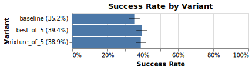
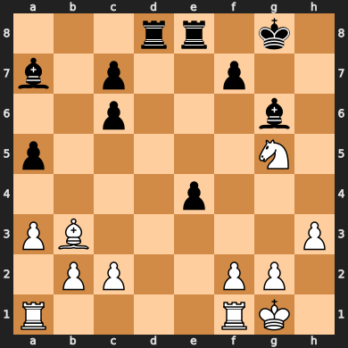

# Example: Improving LLM Chess Ability with Best/Mixture-of-N Sampling

TensorZero supports inference strategies more sophisticated than just a single chat completion.
Among others, it supports best-of-n sampling and mixture-of-n sampling, which sample from several variants concurrently and use another LLM call to combine the answers into a winner.
See [Inference-Time Optimizations](https://www.tensorzero.com/docs/gateway/guides/inference-time-optimizations) in our documentation for more details.

**We'll show that we can improve the performance of an LLM system by increasing the compute budget without changing the prompt or model used.**

  

## Background: Chess Puzzles

Chess puzzles are tactical challenges designed to test and improve a player's chess skills.
They typically present a specific board position where the player must find the best move or sequence of moves to achieve a particular goal, such as checkmate, gaining material advantage, or forcing a draw.
These puzzles are not only excellent training tools for chess players of all levels but also serve as an engaging way to assess an AI's ability to understand and apply chess strategies in complex situations.

This example uses a dataset of chess puzzles from [Kaggle](https://www.kaggle.com/datasets/tianmin/lichess-chess-puzzle-dataset).
After filtering for popular puzzles that were rated to be relatively easy (800-1200 rating), we produced training and testing datasets with ~130k and ~15k puzzles respectively.

Each puzzle consists of a board position and a sequence of moves that solves it.
For example, here's a sample puzzle:

 
<i>white to move</i>

The puzzle consists of a sequence of moves that are "forced" on the player: the player and their opponent would each be significantly disadvantaged if they missed their next move.
We can therefore evaluate an LLM by their exact match to the puzzle solution (or if they manage to achieve a checkmate).
Give this puzzle a try!

<b>Solution</b>

1. B3f7 G6f7
2. G5f7 G8f7

## Getting Started

### TensorZero

In `config/tensorzero.toml`, we define a `play_chess_board` function that takes a chess board position and returns a sequence of moves that solves it.
The function includes a baseline variant with GPT-4o Mini (OpenAI), as well as best-of-5 and mixture-of-5 variants that query the baseline variant five times and combines the results using a final LLM call.

### Prerequisites

1. Install Docker.
2. Install Python 3.9+.
3. Install the Python dependencies with `pip install -r requirements.txt`.
4. Generate an API key for OpenAI (`OPENAI_API_KEY`).

### Setup

1. Create a `.env` file with the `OPENAI_API_KEY` environment variable (see `.env.example` for an example).
2. Run `docker compose up` to launch the TensorZero Gateway, the TensorZero UI, and a development ClickHouse database.
3. Run the `chess_puzzles.ipynb` Jupyter notebook.

## Running the Example

The notebook will evaluate the performance of the `baseline`, `best_of_5`, and `mixture_of_5` variants on the training set of chess puzzles.

Without tuning the prompt or model used, we can spend more inference tokens to boost performance.
We see a ~10% relative improvement in success rate.

## Modifying the Prompt

You might want to try diverse instructions for each LLM call.
We've included several other prompt templates in the `config/functions/play_chess_board/chess_*` directories.
We also can modify the `variant_name` variable to try out different mixture-of-n variants.
You can mix and match these in the `tensorzero.toml` file to try out different configurations.
We saw the diverse variant squeeze a few extra percentage points of performance from the same model and compute budget.
See for yourself if you can get better performance than our `gpt-4o-mini_mixture_of_5_diverse` example!
For example, you could try mixing candidates that use different LLMs.

## Next Steps

You now have a ClickHouse database with a ton of trajectories of LLMs trying to solve chess puzzles.
Consider our library of [recipes](https://www.tensorzero.com/docs/recipes) for ideas on how to use this dataset to improve further!
Since this data ended up in ClickHouse, we also included a test set at `data/lichess_easy_puzzles_test.csv` (use `dryrun=True` to avoid leaking it) to evaluate variants on held-out data.
