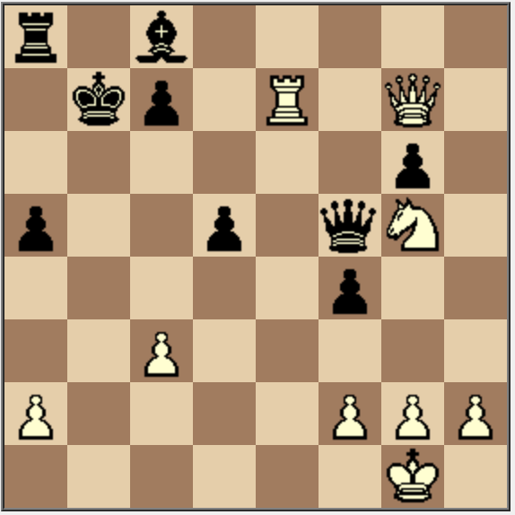

# Example: LLMs solving chess puzzles

One benefit of using TensorZero rather than calling LLMs directly is it was built to support inference strategies more sophisticated than just a single chat completion.
Today, we also support a best-of-n variant type which samples from several variants concurrently and uses another LLM call to select the best result.

In this example, we'll show how you can drop in this experimental best-of-n variant type to spend additional compute budget for better performance on a challenging LLM benchmark.

## Background: Chess Puzzles

Chess puzzles are tactical challenges designed to test and improve a player's chess skills. They typically present a specific board position where the player must find the best move or sequence of moves to achieve a particular goal, such as checkmate, gaining material advantage, or forcing a draw. These puzzles are not only excellent training tools for chess players of all levels but also serve as an engaging way to assess an AI's ability to understand and apply chess strategies in complex situations.

We pulled a large dataset of [Lichess](https://lichess.org) chess puzzles from [Kaggle](https://www.kaggle.com/datasets/tianmin/lichess-chess-puzzle-dataset). After filtering for popular puzzles that were rated to be relatively easy (rating in [800, 1200]), we produced training and testing datasets with ~130k and ~15k puzzles respectively.

Each puzzle consists of a board position and a sequence of moves that solves it.
For example, here's a sample puzzle:



(black to move)

The puzzle consists of a sequence of moves that are "forced" on the player: the player and their opponent would each be significantly disadvantaged if they missed their next move.
We can therefore evaluate an LLM by their exact match to the puzzle solution (or if they manage to achieve a checkmate).
Give this puzzle a try!

<details>
<Summary>Click for the solution!</Summary>
1. ... Qb1+
2. Re1 Qe1#
</details>

## Setup

### TensorZero

We've written TensorZero configuration files to accomplish this example and have provided them in the `config` directory.
See `tensorzero.toml` for the main configuration details.

To get started, create a `.env` file with your OpenAI API key (`OPENAI_API_KEY`) and run the following command.
Docker Compose will launch the TensorZero Gateway and a test ClickHouse database.
Set `CLICKHOUSE_URL=http://localhost:8123/tensorzero` in the shell your notebook will run in.

```bash
docker compose up
```

### Python Environment

#### Using [`uv`](https://github.com/astral-sh/uv) (Recommended)

```bash
uv venv  # Create a new virtual environment
uv pip sync requirements.txt  # Install the dependencies
```

#### Using `pip`

We recommend using Python 3.10+ and a virtual environment.

```bash
pip install -r requirements.txt
```

## Running the Example

TODO
