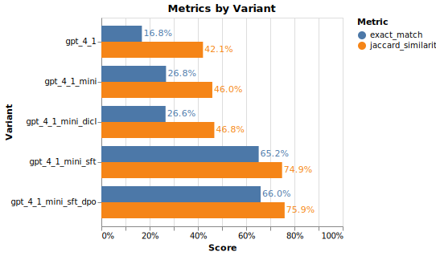

# Example: Optimizing Data Extraction (NER) with TensorZero

## Background

Named Entity Recognition (NER) is the process of identifying and categorizing named entities in text into predefined categories such as person, organization, location, and date. NER is a fundamental task in natural language processing (NLP) and is widely used in various applications such as information extraction, question answering, and machine translation.
Here, we present a stylized example of an NER system that uses TensorZero JSON functions to decode named entities from text.
Each example in the dataset includes a short segment of text and instructs the model to produce a JSON of named entities in the input.
[^1]

**We'll show that TensorZero can optimize GPT-4.1 Mini to increase the performance rate on this task &mdash; at a fraction of the cost and latency &mdash; using a small amount of training data.**

<p align="center"></p>

## Sample Data

### Input

```
The former Wimbledon champion said the immediate future of Australia 's Davis Cup coach Tony Roche could also be determined by events in Split .
```

### Output

```
{
  "person": ["Tony Roche"],
  "organization": [],
  "location": ["Australia", "Split"],
  "miscellaneous": ["Wimbledon", "Davis Cup"]
}
```

</details>

## Getting Started

### TensorZero

We provide a TensorZero configuration file (`config/tensorzero.toml`) to get you started.
The configuration includes a JSON function `extract_entities` with variants for vanilla GPT-4.1 (OpenAI) and GPT-4.1 Mini (OpenAI).
This function uses the output schema in `config/functions/extract_entities/output_schema.json`.

### Prerequisites

1. Install Docker.
2. Install Python 3.10+.
3. Install the Python dependencies with `pip install -r requirements.txt`.
4. Generate an API key for OpenAI (`OPENAI_API_KEY`).

### Setup

1. Create a `.env` file with the `OPENAI_API_KEY` environment variable (see `.env.example` for an example).
2. Run `docker compose up` to launch the TensorZero Gateway, the TensorZero UI, and a development ClickHouse database.
3. Run the `data-extraction-ner-sft-dpo.ipynb` Jupyter notebook.

## Running the Example
The notebook will first attempt to solve the NER task using the `extract_entities` TensorZero JSON function. Under the hood, the TensorZero Gateway will randomly sample either GPT-4.1 or GPT-4.1 Mini each inference.

After completing this process, we evaluate the outputs using exact atch and Jaccard similarity and provide feedback for these metrics to the TensorZero Gateway.

Finally, we run an evaluation on a subset of the validation set to get a clear picture of the performance of each variant.

## Improving the NER System

At this point, your ClickHouse database will include inferences in a structured format along with feedback on how they went. You can now use TensorZero recipes to learn from this experience to produce better variants of the NER system.

In this example, we'll show how a combination of **Supervised Fine-Tuning (SFT)** and **Direct Preference Optimization (DPO)** TensorZero recipes can further optimize the NER system.

### Fine-tune GPT-4.1 Mini with SFT

You can run a fine-tuning recipe by opening the UI (`http://localhost:4000/`) and clicking on the `Supervised Fine-Tuning` tab. Let's run fine-tuning on GPT-4.1 Mini with OpenAI using the `exact_match` metric.
Go grab a coffee, as fine-tuning can take some time.

Once you finish fine-tuning, you'll see additional configuration blocks.
For our purposes, we only need the `model_name`, which we'll use to create a new variant in the `tensorzero.toml` file.

```toml
[functions.extract_entities.variants.gpt_4_1_mini_sft]
type = "chat_completion"
model = "openai::ft:gpt-4.1-mini-2025-04-14:xxxxxxxx::xxxxxxxx"  # TODO: Replace with your model ID
system_template = "functions/extract_entities/initial_prompt/system_template.minijinja"
json_mode = "strict"
```

**Let's restart the TensorZero Gateway to apply the new configuration.** You can do this by killing the running container and re-running `docker compose up`.

To see the new variant for SFT, uncomment #"gpt_4_1_mini_sft" in the `VARIANTS_TO_EVALUATE` list, then re-run the `data-extraction-ner-sft-dpo.ipynb` notebook.

### Fine-tune GPT-4.1-mini-sft with DPO

Once you apply the new configuration and obtain the SFT model, you can use the model to apply DPO on top of it to improve further.
In this example, we'll run the DPO job using the recipe in `recipes/dpo/openai`.

Please make sure to update the following parameters in the `openai_dpo.ipynb` notebook:

```python
CONFIG_PATH = "../../../examples/data-extraction-ner-sft-dpo/config/tensorzero.toml"

FUNCTION_NAME = "extract_entities"

# The name of the variant to use to grab the templates used for fine-tuning
TEMPLATE_VARIANT_NAME = "gpt_4_1_mini_sft"

#  You can can use the base model as below or fine-tunes derived from it for this recipe.
MODEL_NAME = "ft:gpt-4.1-mini-2025-04-14:xxxxxxxx::xxxxxxxx"
```

Once the fine-tuning job is complete, you can see the configuration. For this example, we'll only need the `model_name`, which we'll use to create a new variant in the `tensorzero.toml` file, just like we did for SFT earlier.

```toml
[functions.extract_entities.variants.gpt_4_1_mini_sft_dpo]
type = "chat_completion"
model = "openai::ft:gpt-4.1-mini-2025-04-14:xxxxxxxx::xxxxxxxx"  # TODO: Replace with your model ID
system_template = "functions/extract_entities/initial_prompt/system_template.minijinja"
json_mode = "strict"
```

**Let's restart the TensorZero Gateway to apply the new configuration**, by killing the running container and re-running `docker compose up`.

To see the new variant for DPO, uncomment #"gpt_4_1_mini_sft_dpo", in the VARIANTS_TO_EVALUATE list, then re-run the `data-extraction-ner-sft-dpo.ipynb` notebook.

**You'll see that each fine-tune improves the performance with just a few hundred examples.**

Alternatively, you can run other optimization recipes like [Dynamic In-Context Learning (DICL)](https://www.tensorzero.com/docs/gateway/guides/inference-time-optimizations) programmatically using the Jupyter notebooks in `recipes/`.
We also show the performance of DICL with demonstrations.

You can extend this example to fine-tune other models, such as Llama 3 with Fireworks AI.

[^1]: We build off of the [CoNLL++ dataset](https://arxiv.org/abs/1909.01441v1) and [work](https://predibase.com/blog/lorax-outlines-better-json-extraction-with-structured-generation-and-lora) from Predibase for the problem setting.
