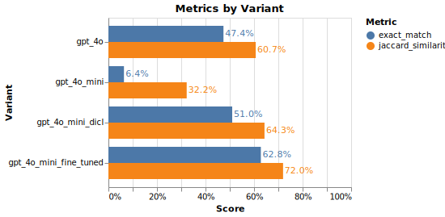

# Example: Optimizing Data Extraction (NER) with TensorZero

## Background

Named Entity Recognition (NER) is the process of identifying and categorizing named entities in text into predefined categories such as person, organization, location, and date. NER is a fundamental task in natural language processing (NLP) and is widely used in various applications such as information extraction, question answering, and machine translation.
Here, we present a stylized example of an NER system that uses TensorZero JSON functions to decode named entities from text.
Each example in the dataset includes a short segment of text and instructs the model to produce a JSON of named entities in the input.
[^1]

**We'll show that TensorZero can optimize GPT-4o Mini to outperform GPT-4o on this task &mdash; at a fraction of the cost and latency &mdash; using a small amount of training data.**

<p align="center">
  
</p>

## Sample Data

### Input

```
The former Wimbledon champion said the immediate future of Australia 's Davis Cup coach Tony Roche could also be determined by events in Split .
```

### Output

```
{
  "person": ["Tony Roche"],
  "organization": [],
  "location": ["Australia", "Split"],
  "miscellaneous": ["Wimbledon", "Davis Cup"]
}
```

</details>

## Getting Started

### TensorZero

We provide a TensorZero configuration file (`config/tensorzero.toml`) to get you started.
The configuration includes a JSON function `extract_entities` with variants for vanilla GPT-4o (OpenAI) and GPT-4o Mini (OpenAI).
This function uses the output schema in `config/functions/extract_entities/output_schema.json`.

### Prerequisites

1. Install Docker.
2. Install Python 3.10+.
3. Install the Python dependencies with `pip install -r requirements.txt`.
4. Generate an API key for OpenAI (`OPENAI_API_KEY`).

### Setup

1. Create a `.env` file with the `OPENAI_API_KEY` environment variable (see `.env.example` for an example).
2. Run `docker compose up` to launch the TensorZero Gateway, the TensorZero UI, and a development ClickHouse database.
3. Run the `data-extraction-ner.ipynb` Jupyter notebook.

## Running the Example

The notebook will first attempt to solve the NER task using the `extract_entities` TensorZero JSON function.
Under the hood, the TensorZero Gateway will randomly sample either GPT-4o or GPT-4o Mini each inference.

After completing this process, we evaluate the outputs using exact match and Jaccard similarity and provide feedback for these metrics to the TensorZero Gateway.

Finally, we run an evaluation on a subset of the validation set to get a clear picture of the performance of each variant.
You might notice that the best performing LLM is GPT-4o from OpenAI (not surprising!).

## Improving the NER System

At this point, your ClickHouse database will include inferences in a structured format along with feedback on how they went.
You can now use TensorZero recipes to learn from this experience to produce better variants of the NER system.

You can run a fine-tuning recipes by opening the UI (`http://localhost:4000/`) and clicking on the `Supervised Fine-Tuning` tab.
Let's run fine-tuning on GPT-4o Mini with OpenAI using the `exact_match` metric.
Go grab a coffee as fine-tuning can take some time.

Alternatively, you can run other optimization recipes like [Dynamic In-Context Learning (DICL)](https://www.tensorzero.com/docs/gateway/guides/inference-time-optimizations) programmatically using the Jupyter notebooks in `recipes/`.
We also show the performance of DICL with demonstrations.

Once you finish fine-tuning, you'll see additional configuration blocks.
For our purposes, we only need the `model_name` which we'll use to create a new variant in the `tensorzero.toml` file.

```toml
[functions.extract_entities.variants.gpt_4o_mini_fine_tuned]
type = "chat_completion"
model = "openai::ft:gpt-4o-mini-2024-07-18:xxxxxxxx::xxxxxxxx"  # TODO: Replace with your model ID
system_template = "functions/extract_entities/initial_prompt/system_template.minijinja"
json_mode = "strict"
```

**Let's restart the TensorZero Gateway to apply the new configuration.**
You can do this by killing the running container and re-running `docker compose up`.

Finally, re-run the `data-extraction-ner.ipynb` notebook to see how the new variant performs.

**You'll see that the fine-tuned GPT-4o Mini outperforms GPT-4o on this task with just a few hundred examples!**

You can extend this example to fine-tune other models, such as Llama 3 with Fireworks AI.

[^1]: We build off of the [CoNLL++ dataset](https://arxiv.org/abs/1909.01441v1) and [work](https://predibase.com/blog/lorax-outlines-better-json-extraction-with-structured-generation-and-lora) from Predibase for the problem setting.
