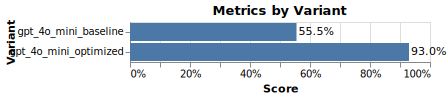

# Example: Improving Math Reasoning with a Custom Recipe for Automated Prompt Engineering (DSPy)

TensorZero provides a number of pre-built optimization recipes covering common LLM engineering workflows.
But you can also easily create your own recipes and workflows!

This example shows how to optimize a TensorZero function using an arbitrary tool — here, [DSPy](https://github.com/stanfordnlp/dspy).

**Here, we achieve a massive boost in performance in the GSM8K dataset by optimizing a naive baseline prompt by incorporating in-context examples automatically curated by DSPy.**

> [!NOTE]
>
> In practice, most of the performance gains come from formatting the LLM's response to fit GSM8K's idiosyncratic output format.
> Regardless, this example demonstrates that in-context learning is a powerful technique for prompt engineering.

> [!TIP]
>
> See our [Dynamic In-Context Learning (DICL)](https://www.tensorzero.com/docs/gateway/guides/inference-time-optimizations#dynamic-in-context-learning-dicl) inference-time optimization for an even more powerful technique that curates in-context examples at inference time based on the input.

## Background

The [GSM8K dataset](https://github.com/openai/grade-school-math) from OpenAI is a collection of ~8,000 grade school math word problems and their solutions.
It has lately seen extensive use as a simple benchmark for evaluating LLMs.
We include an example of a very simple implementation of a TensorZero function for solving GSM8K in this example.
Since this benchmark is relatively easy, we have configured this example to use the Llama 3.1 8B model (zero-shot) served on Together's API.

After running the example and generating some data, we show how to query a dataset of inferences from the ClickHouse database in order to optimize the prompt using a DSPy teleprompter.

## Getting Started

### TensorZero

We provide a TensorZero configuration file (`config/tensorzero.toml`) to get you started.
The configuration includes a function `solve_math_problem` with variants for GPT-4o Mini (OpenAI) with a naive baseline prompt and a DSPy-optimized prompt.

### Prerequisites

1. Install Docker.
2. Install Python 3.10+.
3. Install the Python dependencies with `pip install -r requirements.txt`.
4. Generate an API key for OpenAI (`OPENAI_API_KEY`).

### Setup

1. Create a `.env` file with the `OPENAI_API_KEY` environment variable (see `.env.example` for an example).
2. Run `docker compose up` to launch the TensorZero Gateway, the TensorZero UI, and a development ClickHouse database.
3. Run the `gsm8k_dspy.ipynb` Jupyter notebook.

## Running the Example

The `gsm8k_dspy.ipynb` notebook will first attempt to tackle the GSM8K dataset using a naive baseline prompt.
After collecting some binary feedback data (not the complete labels!), we use DSPy to generate an optimized variant.

Under the hood, DSPy curates a dataset of in-context examples to optimize the prompt for the task.
After this process, we see a massive boost in performance!
