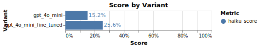

# Example: Optimizing LLMs to Satisfy a Judge with Hidden Preferences

## Background

Many LLM applications produce content that depends on the preferences of an individual or group.
For example, LLMs can generate advertising copy or sales emails to drive purchasing decisions.

In these cases, the developer might have some intuition for a reasonable starting point, but an ideal solution needs to learn the specific preferences of a particular individual or group.
Over time, if feedback signals can be collected, the system can learn to produce content that satisfies preferences.

Here we present a stylized example of such a system.
We've built a system that writes haikus about a variety of topics to satisfy an LLM judge with hidden preferences.
The judge accepts or rejects haikus, and the haiku writer needs to learn to write haikus that satisfy the judge's preferences.
This is similar to learning from thumbs up/down, conversions, and other boolean feedback signals.
[^1]

**We'll show that GPT-4o Mini can be fine-tuned on a small amount of thumbs up/down feedback data to learn granular hidden preferences.**

<p align="center"></p>

## Getting Started

### TensorZero

We've written TensorZero configuration files to accomplish this example and have provided them in the `config` directory.
See `tensorzero.toml` for the main configuration details.
You can also find the judge's preferences in `config/functions/judge_haiku/judge_prompt/system_template.minijinja`.

### Prerequisites

1. Install Docker.
2. Install Python 3.10+.
3. Install the Python dependencies with `pip install -r requirements.txt`.
4. Generate an API key for OpenAI (`OPENAI_API_KEY`).

### Setup

1. Create a `.env` file with the `OPENAI_API_KEY` environment variable (see `.env.example` for an example).
2. Run `docker compose up` to launch the TensorZero Gateway, the TensorZero UI, and a development ClickHouse database.
3. Run the `haiku.ipynb` Jupyter notebook.

## Running the Example

The notebook uses the `write_haiku` function to generate haikus and the `judge_haiku` function to judge them.
The feedback from the judge is sent as feedback to the TensorZero Gateway.
Initially, the haiku writer has no knowledge of the judge's idiosyncratic preferences, so the haikus will receive a fairly low score.

At this point, your ClickHouse database will contain inferences in a structured format along with feedback on how they went.
You can now use TensorZero recipes to learn from this experience to produce better variants of the haiku writer.
We recommend starting with supervised fine-tuning of a custom OpenAI model using the TensorZero UI (`http://localhost:4000/optimization/supervised-fine-tuning`).
You can also easily experiment with other models, prompts you think might be better, or combinations thereof by editing the configuration.

<details>
<summary>
<b>Fine-Tuning Programmatically</b>
</summary>

Alternatively, you can run a fine-tuning recipe programmatically using the Jupyter notebook in `recipes/supervised_fine_tuning/`.

</details>

Once you finish fine-tuning, you'll see additional configuration blocks.
For our purposes, we only need the `model_name` which we'll use to create a new variant in the `tensorzero.toml` file.

```toml
[functions.write_haiku.variants.gpt_4o_mini_fine_tuned]
type = "chat_completion"
model = "openai::ft:gpt-4o-mini-2024-07-18:xxxxxxxx::xxxxxxxx"  # TODO: Replace with your model ID
system_template = "functions/write_haiku/initial_prompt/system_template.minijinja"
user_template = "functions/write_haiku/initial_prompt/user_template.minijinja"
json_mode = "strict"
```

**Let's restart the TensorZero Gateway to apply the new configuration.**
You can do this by killing the running container and re-running `docker compose up`.
Finally, re-run the `haiku.ipynb` notebook to see how the new variant performs.

**From a single fine-tune we typically see a relative improvement of ~50% in the haiku score.**
**Not bad, given that we only had a few dozen good examples and binary labels!**

> [!TIP]
>
> If you keep generating more examples and fine-tuning, the score should improve further.
> Better models generate better data, and better data leads to even better models!

[^1]: We use a [list of common nouns](https://www.desiquintans.com/nounlist) as the set of topics for the haikus.
