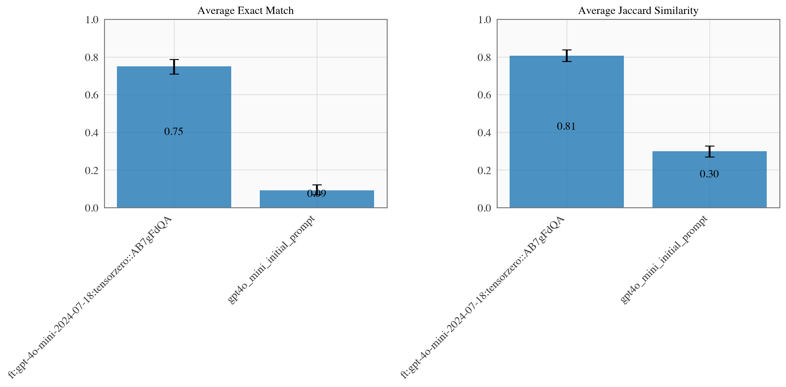

# Example: Improving Data Extraction (NER) by Fine-Tuning a Llama 3 Model Using Demonstrations

## Background

Named Entity Recognition (NER) is the process of identifying and categorizing named entities in text into predefined categories such as person, organization, location, and date. NER is a fundamental task in natural language processing (NLP) and is widely used in various applications such as information extraction, question answering, and machine translation.

Once upon a time, this was done using rule-based systems or special-purpose models. In light of progress in foundation models, most would use an LLM to address this task today, especially given recent advancements in structured decoding and JSON mode offerings from most inference providers.

Here, we present a stylized example of a NER system that uses TensorZero JSON functions to decode named entities from text.
We build off of the [CoNLL++ dataset](https://arxiv.org/abs/1909.01441v1) and [work](https://predibase.com/blog/lorax-outlines-better-json-extraction-with-structured-generation-and-lora) from Predibase for the problem setting.
Each example in the dataset includes a short segment of text and instructs the model to produce a JSON of named entities in the input.
We provide the output schema to TensorZero at `config/functions/extract_entities/output_schema.json`.
In our problem setting, we consider any output that fails to validate against the schema to be incorrect.

We'll show that using a handful of demonstrations to fine-tune an LLM can lead to a significant improvement in performance.
Using the notebook in `recipes/supervised_fine_tuning/demonstrations/openai.ipynb`, we can fine-tune a GPT-4o mini model to achieve ~75% accuracy on the CoNLL++ dataset compared to ~10% for the base model.

## Setup

### TensorZero

We've written TensorZero configuration files to accomplish this example and have provided them in the `config` directory.
See `tensorzero.toml` for the main configuration details.

To get started, create a `.env` file with your OpenAI API key (`OPENAI_API_KEY`) and run the following command.
Docker Compose will launch the TensorZero Gateway and a test ClickHouse database.

```bash
docker compose up
```

### Python Environment

#### Using [`uv`](https://github.com/astral-sh/uv) (Recommended)

```bash
uv venv  # Create a new virtual environment
uv pip sync requirements.txt  # Install the dependencies
```

#### Using `pip`

We recommend using Python 3.10+ and a virtual environment.

```bash
pip install -r requirements.txt
```

## Running the Example

Set `TENSORZERO_CLICKHOUSE_URL=http://localhost:8123/tensorzero` in the shell your notebook will run in.

You can run the example in the `conll.ipynb` notebook.
Make sure to install the dependencies in the `requirements.txt` file.
It should not require any changes to run and will automatically connect to the TensorZero Gateway you started.

The notebook will first attempt to solve the NER task using the `extract_entities` JSON function and randomly sample either GPT-4o or vanilla Llama 3.1 8B to do it with.
After this is done, we evaluate the output using both an exact match metric and Jaccard similarity.
We provide feedback in each of these metrics to TensorZero to learn from the results.

Afterwards we run an evaluation on a subset of the test set (and use the same set for each variant) to get a clear picture of the performance of each variant.
This inference is performed with a variant specified and `dryrun` set to `true` to avoid storing the data and contaminating the training set.

## Improving the NER System

At this point, your ClickHouse database will include inferences in a structured format along with demonstrations of the correct output (training data).
You can now use TensorZero recipes to learn from this experience to produce better variants of the NER system.
Since the initial performance of GPT-4o mini is not very good (I saw ~10% exact match accuracy), we'll need to use the `recipes/supervised_fine_tuning/demonstrations/openai.ipynb` notebook to fine-tune a GPT-4o Mini model to achieve ~75% accuracy on the CoNLL++ dataset.
At the conclusion of that notebook you should see a few blocks to add to `tensorzero.toml` to update the system to use the new model and the corresponding variant.
Even with ~100 examples, we see a significant improvement in performance over the base model.
You can experiment with other recipes,models, prompts you think might be better, or combinations thereof by editing the configuration.
You can also experiment with how many demonstrations to include in the fine-tuning process.
See how few examples you need to get a serious performance boost!

## Experimenting with Improved Variants

Once you've generated one or more improved variants (and, critically, given them some positive weight), you should restart the TensorZero Gateway with the new configuration:

```bash
docker compose up
```

You can then re-run the test set evaluation in the `conll.ipynb` notebook to see how the new variants perform.
You should see a clear improvement over the baseline.

We used 100 demonstrations to fine-tune the GPT-4o mini model and achieved a significant improvement in performance as shown in the plot below.


