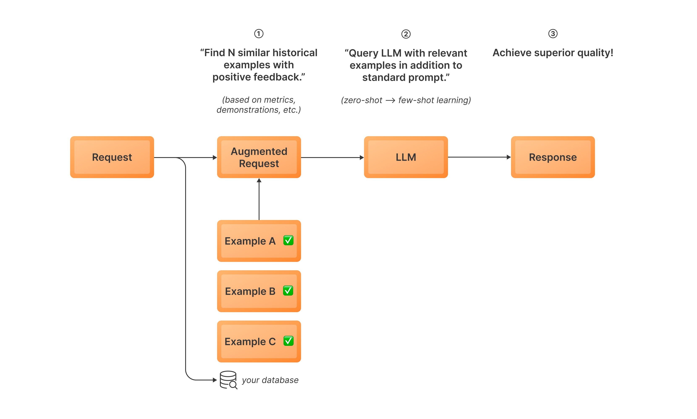

# Dynamic In-Context Learning (DICL)

**[Documentation for DICL →](https://www.tensorzero.com/docs/gateway/guides/inference-time-optimizations#dynamic-in-context-learning-dicl)**

_Dynamic In-Context Learning is a powerful inference-time optimization technique that you can easily leverage out of the box with TensorZero._

LLMs are excellent few-shot learners.
In-context learning with examples is a convenient and effective way to improve performance, bridging the gap between zero-shot prompting and fine-tuning.
For any given input, using similar examples of successful outcomes as context can significantly improve performance.

As TensorZero is designed to store inferences and feedback in structured format, it is easy to query a dataframe of examples that were successful and then use them to do in-context learning with a new input.

This recipe provides an example on how to select inferences for DICL based on positive feedback.
For float metrics, we offer the option to choose a cutoff score that qualifies an inference as successful and worthy of inclusion in the dynamic in-context learning examples.
For demonstrations, we assume all are suitable.
We expose all these settings in the beginning of `dicl.ipynb`.
You may also want to modify this notebook to use your own strategies for choosing examples.
