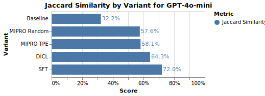

# TensorZero Recipe: Automated Prompt Engineering with MIPRO

The [mipro.ipynb](mipro.ipynb) notebook provides a step-by-step recipe to perform automated prompt engineering for OpenAI models based on data collected by the TensorZero Gateway.

## MIPRO (Multi-prompt Instruction PRoposal Optimizer)

MIPRO is an optimization framework designed for multi-stage Language Model (LM) applications. It enhances prompt effectiveness by systematically searching over instructions and few-shot demonstrations to maximize downstream task performance. Unlike traditional prompt engineering, which relies on manual trial-and-error methods, MIPRO introduces algorithmic strategies for optimizing LM programs under constraints such as black-box model access.

## High-Level Structure

MIPRO operates within a structured optimization framework:

- Proposal Generation: Generates candidate instructions and demonstrations.

- Evaluation: Scores generated prompts based on their effectiveness.

- Optimization: Utilizes a surrogate model to refine prompt proposals based on observed performance.

For more details, see the [MIPRO paper](https://arxiv.org/abs/2406.11695v1), and the [DSPy Repository](https://github.com/stanfordnlp/dspy).

In our implementation, we use an LLM judge to score the candidate prompts. The judge is configuable to fit your problem by describing the task and metric you want to optimize. This assumes that the LLM judge will output scores that are correlated with the metric you want to optimize.

**We'll show that TensorZero can optimize GPT-4o Mini using MIPRO and compare the results to our Dynamic In-Context Learning (DICL), and Supervised Fine-Tuning (SFT) recipes.**

<p align="center">
  
</p>

We see that MIPRO achieves competitive results compared to DICL. The MIPRO optimized variant can be more efficient than DICL at test time as it does not require searching for the set of demonstrations for a given user prompt.

## Setup

Set the `OPENAI_API_KEY` in the shell your notebook will run in.

### Using [`uv`](https://github.com/astral-sh/uv) (Recommended)

```bash
uv venv  # Create a new virtual environment
source .venv/bin/activate
uv pip sync requirements.txt  # Install the dependencies
```

### Using `pip`

We recommend using Python 3.10+ and a virtual environment.

```bash
pip install -r requirements.txt
```
